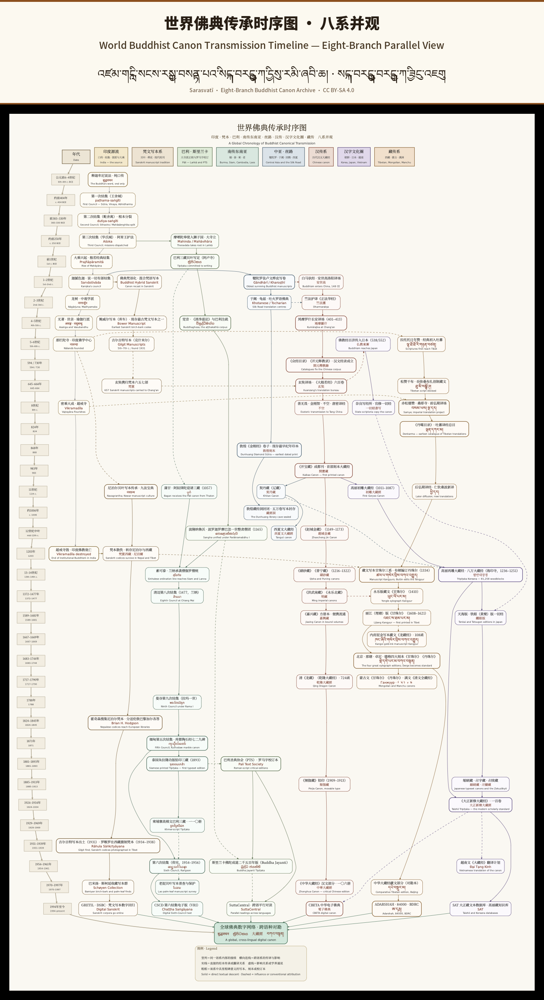

<!-- Language: 한국어 (ko) -->

# Sarasvatī — 세계 불교 정전을 위한 글로벌 오픈 아카이브 + 불교 AI 헌장

  
   
  <i>세계 불전 팔계 전승 시대순 도표 · 팔계 병관(中文 · English · བོད་ཡིག 삼언어 제목) 전체 PDF 보기：<a href="../docs/Global-Buddhist-Canon-Transmission-Timeline.pdf"><code>docs/Global-Buddhist-Canon-Transmission-Timeline.pdf</code></a></i>

**Sarasvatī**(티베트어: དབྱངས་ཅན་མ། · 산스크리트어: सरस्वती)는 정확히 두 가지 일을 합니다:

1. **8계통 정전 아카이브.** 불교 정전 전승의 여덟 갈래를 따라 다국어 오픈 아카이브를 구축합니다: **인도 원류 · 산스크리트 필사본계 · 팔리·스리랑카 · 동남아 상좌부 · 실크로드·중앙아시아 · 한역 대장경 · 한자문화권 · 티베트계**. 공공영역 텍스트만 사용하거나, 살아 있는 전통과의 명시적 협업.
2. **알고리즘에 보리심을 심다.** 붓다의 마지막 가르침(『대반열반경』)을 **열 가지 원칙 + 다섯 가지 거절 조항**으로 증류하여, 어떤 AI 시스템·운영자·팀도 채택할 수 있는 헌장으로 공개합니다. *Ahiṃsā(불살생) · karuṇā(자비) · anattā(무아) · anicca(무상) · upekkhā(사)* 를 슬로건이 아닌 알고리즘 층위에서 실행 가능한 제약으로 만듭니다.

모든 산출물은 **CC BY-SA 4.0** 라이선스로 공개됩니다.

## 왜 이 일을 하는가

고전 텍스트는 인류의 공동 유산입니다. 저작권으로 갇히거나, 전쟁으로 불타거나, 링크 단절로 사라져서는 안 됩니다. 또한 AI 시스템이 참된 지혜 전통에서 나온 윤리적 제약 없이 배포되어서도 안 됩니다. Sarasvatī 는 이 두 가지를 동시에 다룹니다 — 기억의 층(아카이브)과 윤리의 층(헌장).

## 현재 상태

**v0.6.3**(2026-08-29):

- 🖼 **v0.6.3 신규** — 상단에 **삼언어 제목 전승 시대순 도표 배너**(중·영·티)를 추가, **A 교감(校勘) 82건**이 불전 팔계 전승(인도 원류 · 산스크리트 사본계 · 팔리·스리랑카 · 동남아 상좌부 · 실크로드 · 한역대장경 · 한자문화권 · 티베트계)을 포괄합니다.
- 📜 **Buddhist AI Charter** — 열 가지 원칙 + 다섯 가지 거절 + 서명 조항, `charter/BUDDHIST-AI-CHARTER.md`. 24개 언어로 번역되어 `charter/i18n/` 에 있으며, 각 언어권의 불교 학자·모국어 화자의 검토를 기다리고 있습니다.
- 🕉 **『대반열반경』4언어 대조 독송**(DN 16.2.26 · 16.4.7 · 16.6.7) — 팔리 · 영어 · 한문 · 티베트어, `translations/mahaparinibbana-sutta/`. 이는 헌장의 경전적 뿌리이며, 아카이브의 첫 번째 씨앗 텍스트입니다.
- 📊 **구조화된 타임라인 데이터** — 8계통(india, sanskrit, pali, seasia, silkroad, chinese, sinosphere, tibetan)에 걸친 80개의 정전 전승 사건, JSONL / CSV 형식, `docs/timeline-data/`.
- 📋 프로젝트 문서: `README.md`, `ROADMAP.md`, `CALL-FOR-HELP.md`, `CONTRIBUTORS.md`, `announcements/`.

## 로드맵(8계통)

Sarasvatī 의 장기 구조는 세계 불교 정전 전승 타임라인을 따릅니다: **인도 · 산스크리트 필사본 · 팔리 · 동남아 상좌부 · 실크로드 · 한역 대장경 · 한자문화권 · 티베트**. 각 계통은 최소한 하나의 「첫 표본」을 가집니다: 공공영역 원본 텍스트 → 아직 번역이 없는 언어로의 기계 번역 초안 → 이름이 명시된 인간 검토자. 티베트계는 이미 첫 자산(DN 16)이 있으며, 팔리계는 같은 DN 16 4언어 대조 독송을 통해 초보적으로 다루어졌습니다. 나머지 6개 계통(인도, 산스크리트, 동남아, 실크로드, 한역, 한자문화권)은 기여자에 의한 착수를 환영합니다.

## 보호 계층

모든 산출물은 다음 계층으로 보호됩니다:

- **로컬 미러** — macOS.
- **GitHub 공개 저장소** — https://github.com/lurongpan47/Sarasvati.
- **AWS 지리적 이중화 미러** — 여러 리전.
- **IPFS 분산 미러** — CID `bafybeiaxtdu4smx54b662ebuqlefmei5hpbu63zefzpox2msefwddfduce`.
- **OpenTimestamps → Bitcoin** — `manifests/SHA256SUMS` 에 대한 부인 불가능한 시간 앵커.

## ⚠️ 면책 조항

이 저장소의 모든 번역과 기계 번역 텍스트는 전문가 검토를 기다리는 **AI 기계 초안**입니다. 이름이 명시된 전문가의 검증 없이 의례, 교리, 의학, 학술적 권위로 취급하지 마십시오.

## 기여 방법

- 텍스트, 장 개정, 용어 수정, 또는 특정 언어의 헌장 검토를 제안하는 이슈를 여십시오.
- Fork, 편집, PR. 모든 기여는 CC BY-SA 4.0 으로 접수됩니다.
- 미러를 운영하십시오. 아카이브 보존에 도움을 주십시오.
- **헌장의 런타임**(Python + TypeScript guardrail 라이브러리) 구축을 도와주십시오 — 자세한 내용은 `CALL-FOR-HELP.md`.

## 링크

- GitHub: https://github.com/lurongpan47/Sarasvati
- 라이선스: CC BY-SA 4.0

---

*"Vayadhammā saṅkhārā, appamādena sampādetha."*
*모든 조건 지어진 것은 무상하니, 부지런히 정진하라.*
